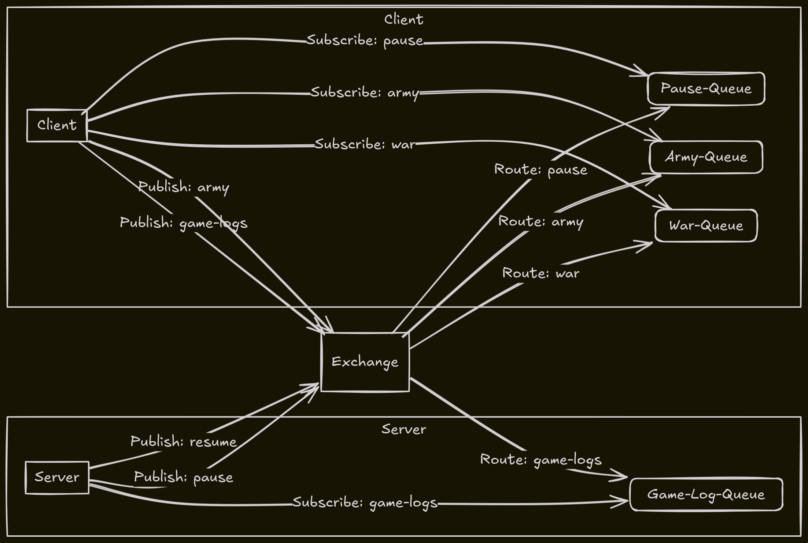

# Rust RabbitMQ Project -  Peril(Similar to Risk Board Game)
This project demonstrates a simple client-server application using RabbitMQ in Rust with a game called Peril. It is based on the boot.dev learn pub sub course using go. It includes:

Server: A Rust program that listens for messages on a RabbitMQ queue.
Client: A Rust program that sends messages to a RabbitMQ queue.
Scripts: Bash scripts to simplify running multiple clients and managing the RabbitMQ Docker container.
Prerequisites
Docker
Rust
Getting Started
Build the RabbitMQ Docker image:
docker build -t rabbitmq-stomp .

2. **Run the RabbitMQ container:**
    
    Bash
    
    ```
    docker run -d --rm --name rabbitmq -p 5672:5672 -p 15672:15672 -p 61613:61613 rabbitmq-stomp
    ```
    
    Or use the provided script:
    
    Bash
    
    ```
    ./rabbitmq.sh start 
    ```
    
3. **Build the Rust project:**
    
    Bash
    
    ```
    cargo build --release
    ```
    
4. **Run the server:**
    
    Bash
    
    ```
    cargo run --release --bin server
    ```
    
5. **Run the client:**
    
    Bash
    
    ```
    cargo run --release --bin client
    ```
    

## Running Multiple Clients

Use the `run_clients.sh` script to start multiple client instances:

Bash

./run_clients.sh 5 # Starts 5 clients


## Handy Script

The `rabbitmq.sh` script provides commands for managing the RabbitMQ container:

- `./rabbitmq.sh start`: Starts the container.
- `./rabbitmq.sh stop`: Stops the container.
- `./rabbitmq.sh logs`: Shows the container logs.

## Project Structure

- `src/`: Contains the Rust source code for the server and client.
- `Dockerfile`: Defines the RabbitMQ Docker image.

## Dependencies

- `lapin`: A Rust library for interacting with RabbitMQ.
- `tokio`: An asynchronous runtime for Rust.


## Contributing

Contributions are welcome! Feel free to open issues or pull requests.

## License

This project is licensed under the [MIT License](https://www.google.com/url?sa=E&source=gmail&q=LICENSE).

